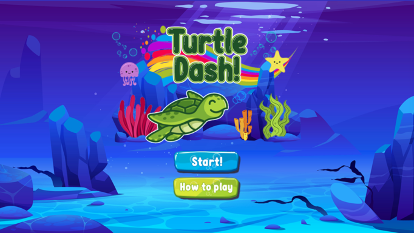
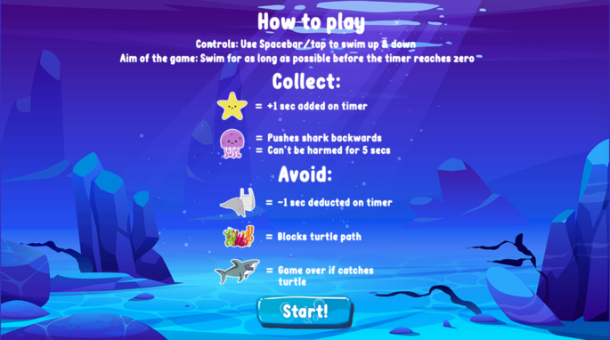
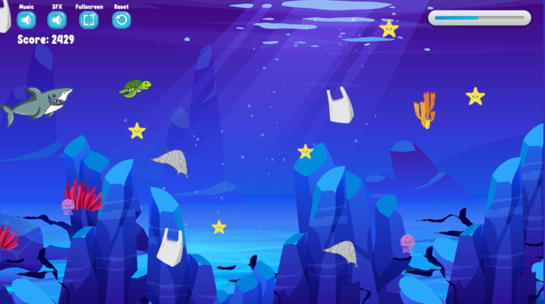
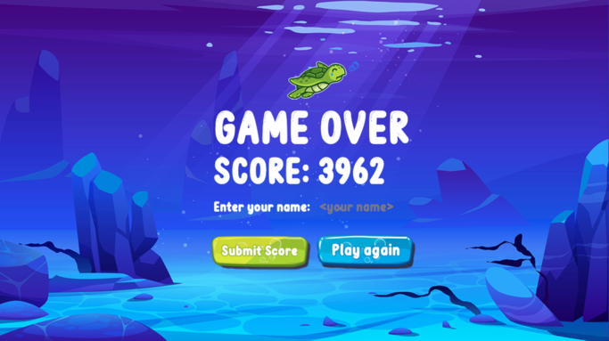
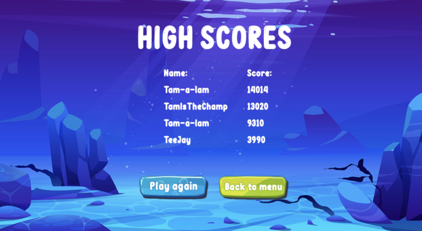
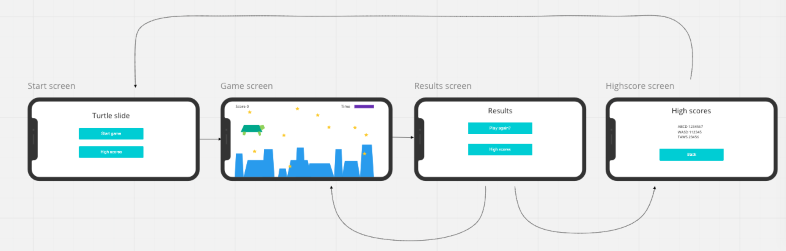

# Turtle Dash

## Project overview
Welcome to Turtle Dash, an addictive game created in Phaser.js. 

Try out our app here: [Turtle Dash](http://turtle-dash.surge.sh/)

## The team
[Imogen Kraak](https://github.com/imogen-k)

[Yasmin Underdown](https://github.com/yu2491)

[Tamara Jeffery](https://github.com/just-tam)

[Charlotte Smallwood-Smith](https://github.com/Charlotte-91)

[Carlo Boamah](https://github.com/cabju)

## Project process

We started out by mind mapping ideas for our project, checkout our [project board](https://miro.com/app/board/o9J_kipU7tY=/) to see our progress throughout our two week project.

## Challenges

### React native game engine and matter.js
We started building our app with React native game engine and matter.js. After a day or so of trial and error, with very slow progress we came across a few blocks.
These blocks were to do with the physics and basic game elements. We struggled to get our player to move how we desired. 
Due to slow progress and lack of documentation for both React Native game engine and Matter.js we decided it would be better change tech stack.
We believe that it may have been able to compleate the project with our original tech stack however we would not have been able to complete it within the time constraints we had. 
We decided to do some individual research to pick out a new tech stack and we chose Phaser.js. We were able to progress well in a short amount of time using the new tech stack and therefore decided that we made the correct choice.

### Hills
Originally our game was supposed to be a 'hill surfing game' similar to something such as 'Tiny wings'. However we struggled with getting the assets to behave and interact in the correct way to achieve this.
Therefore we changed our game design slightly, making the character swim through the space rather than surfng on underwater 'hills' like we first originally planned.

## Installation and setup

* Clone this repositry locally with `git clone https://github.com/imogen-k/turtle-wiggle.git`
* Change into the project folder with  `cd turtle-wiggle`
* Install all dependencies with `npm install`
* To run locally install a local server such a Live server on VS code
* Right click on the `index.html` file and select `Open with live server' to run

## Technologies

* [Node](https://nodejs.org/en/)

* [Phaser](https://phaser.io/)

* [Surge](https://surge.sh/)
