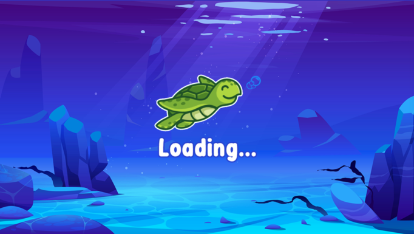
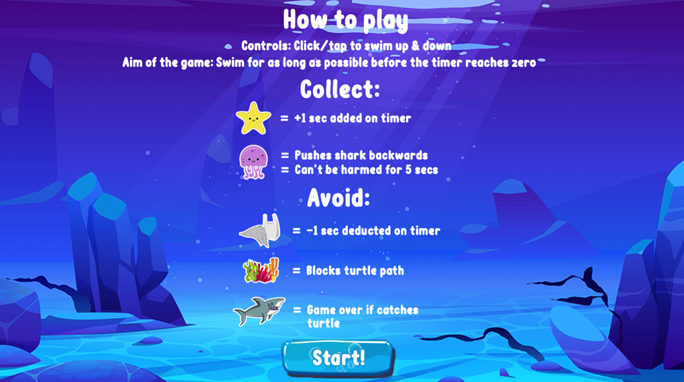
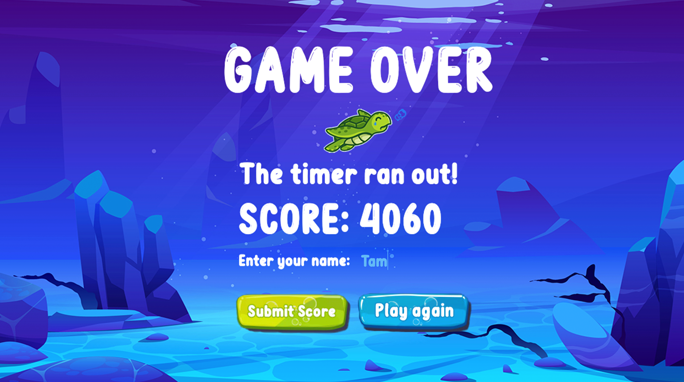
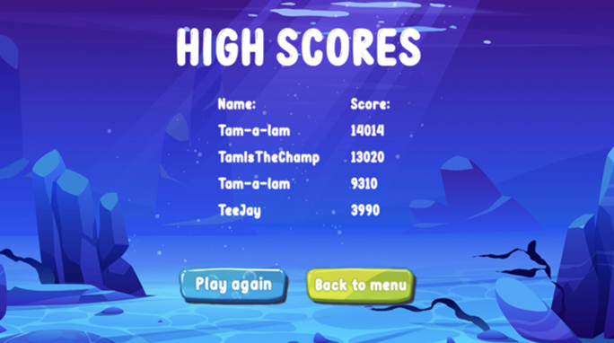

# Turtle Dash

## Project overview
Welcome to Turtle Dash, an addictive game created in Phaser.js. 

Try out our app here: [Turtle Dash](http://turtle-dash.surge.sh/)

## The team
[Imogen Kraak](https://github.com/imogen-k)

[Yasmin Underdown](https://github.com/yu2491)

[Tamara Jeffrey](https://github.com/just-tam)

[Charlotte Smallwood-Smith](https://github.com/Charlotte-91)

[Carlo Boamah](https://github.com/cabju)

## Project process

*  What is your project?

Ocean themed side scrolling sliding game, with physics.

* Who are your users? What features are important for them?

Casual mobile gamers. Simple controls, easy to understand end goal, highly re-playable (achieved by score improvement), clear instructions.

We started out by mind mapping ideas for our project, checkout our [project board](https://miro.com/app/board/o9J_kipU7tY=/) to see our progress throughout our two week project. Originally we planned to use React Native, React Native game engine and Matter.js to build our game. However after some difficulties we changed our tech stack to Node.js and Phaser.js.

As well as sea objects such as coral, we decided to add in nets and plastic bags as obstacles. We did this to do this to make players aware of the dangers of single use plastics and hope that this would encourage players to cut down on their plastic usage.

### Wireframe

## Challenges

### React native game engine and matter.js
We started building our app with React native game engine and matter.js. After a day or so of trial and error, with very slow progress we came across a few blocks.
These blocks were to do with the physics and basic game elements. We struggled to get our player to move how we desired. 
Due to slow progress and lack of documentation for both React Native game engine and Matter.js we decided it would be better to change tech stack.
We believe that it may have been able to complete the project with our original tech stack however we would not have been able to complete it within the time constraints we had. 
We decided to do some individual research to pick out a new tech stack and we chose Phaser.js. We were able to progress well in a short amount of time using the new tech stack and therefore decided that we made the correct choice.

### Hills
Originally our game was supposed to be a 'hill surfing game' similar to something such as 'Tiny wings'. However we struggled with getting the assets to behave and interact in the correct way to achieve this.
Therefore we changed our game design slightly, making the character swim through the space rather than surfing on underwater 'hills' like we first originally planned.

### Tests
We attempted to test using Jest, but due to some quirks with Phaser.js we did not manage to get the tests running. Whilst researching we found that there is no recommended testing framework for Phaser.js, we considered creating our own testing framework, but we simply did not have time. We did however complete a lot of feature testing by playing the game, where we found many bugs, which we fixed before the completion of our game. 

## Installation and setup

* Clone this repository locally with `git clone https://github.com/imogen-k/turtle-dash.git`
* Change into the project folder with  `cd turtle-dash`
* Install all dependencies with `npm install`
* To run locally install a local server such a Live server on VS code
* Right click on the `index.html` file and select `Open with live server' to run

## Technologies

* [Node](https://nodejs.org/en/)

* [Phaser](https://phaser.io/)

* [Surge](https://surge.sh/)

